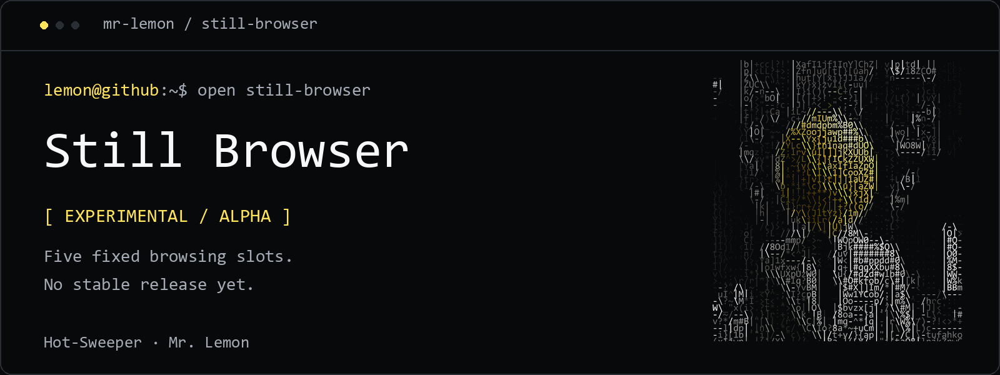

<picture>
  <source media="(max-width: 600px)" srcset=".github/assets/banner-mobile.png">
  
</picture>

# Still Browser

> **Experimental · Alpha — no stable release yet.** Still is under active development. Available downloads are test builds; features and behavior may change, and bugs are expected.

Still is a calm, open-source Chromium browser built around five fixed browsing slots. It keeps a small working set visible, restores it between launches, and avoids the usual ever-growing tab bar.

[](https://github.com/Hot-Sweeper/still-browser/actions/workflows/ci.yml)
[](https://github.com/Hot-Sweeper/still-browser/releases)
[](LICENSE)

## Highlights

- Five persistent slots with drag-to-reorder behavior
- Middle-click and incoming web links use an empty slot or ask which slot to replace
- Back, forward, reload, hard reload, and address-search shortcuts
- Downloads view with pause, resume, retry, reveal, and recovery support
- YouTube video, audio, and thumbnail downloads through a verified bundled `yt-dlp`
- Per-site camera, microphone, location, and notification permissions
- Light, dark, and system themes
- External application links (`mailto:`, Zoom, Teams, Spotify, and similar) require confirmation
- Windows-only first-run migration for Opera GX bookmarks, history, cookies, and compatible extensions

## Try an alpha build

There is no stable release yet. To help test Still, download an experimental prerelease build from [GitHub Releases](https://github.com/Hot-Sweeper/still-browser/releases):

- Linux: use the portable `.AppImage`, or install the `.deb` on Debian, Ubuntu, or Linux Mint.
- Windows: run the portable `.exe`.

FFmpeg is recommended for merging high-quality YouTube video/audio streams. Install it with your operating system's package manager and ensure `ffmpeg` is on `PATH`.

## Run from source

Requirements:

- Node.js 22.12 or newer
- npm 10 or newer
- Git

```bash
git clone https://github.com/Hot-Sweeper/still-browser.git
cd still-browser
npm ci
npm start
```

`npm ci` downloads the official `yt-dlp` executable for the current platform and verifies it against the release's SHA-256 checksum before storing it under the ignored `build/vendor` directory.

## Keyboard and mouse controls

- `Ctrl+L` — search or enter an address
- `Ctrl+T` — use the next empty slot
- `Ctrl+W` — clear the current slot
- `Ctrl+1` through `Ctrl+5` — switch slots
- `Alt+Left` / `Alt+Right` — back / forward
- Mouse Back / Forward buttons — back / forward
- Middle-click a link — open it using the same slot chooser as an incoming URL
- `Ctrl+R` or `F5` — reload
- `Ctrl+Shift+R` — hard reload without cache

Move the pointer to the physical top edge of the window to reveal the slot rail. Double-click an occupied slot to edit its address, or click an empty slot to search immediately.

## Build packages

```bash
npm run check
npm run pack
```

Platform-specific distributables:

```bash
npm run dist:linux
npm run dist:win
npm run dist:mac
```

Linux builds produce AppImage and Debian packages. Windows packaging additionally requires the .NET 8 SDK to compile the small native mouse-navigation helper. macOS source support is included, while automated release artifacts currently target Linux and Windows.

## Platform notes

Still stores each device's browsing profile locally; cloning the repository synchronizes the application code, not private cookies or history.

- Windows profile: `%APPDATA%\Focus Slots` (kept for compatibility with early Still builds)
- Linux profile: `~/.config/Still`
- macOS profile: `~/Library/Application Support/Still`

Opera GX migration runs only on Windows because Opera GX's profile encryption uses Windows DPAPI. It reads from the default Opera GX profile and never writes to it. Imported cookie values are decrypted in memory and immediately stored through Chromium's cookie API.

Electron supports only a subset of Chromium extension APIs. Content-script extensions generally work after migration, while browser-toolbar popups and Opera-specific APIs may not.

## Development

The main process and platform integration live in `src/main.js`. The browser shell is implemented in `src/index.html`, `src/renderer.js`, and `src/styles.css`. Website content runs in isolated Electron webviews using the persistent `persist:still` session.

See [CONTRIBUTING.md](CONTRIBUTING.md) for the development workflow. Please report security issues according to [SECURITY.md](SECURITY.md).

## License

[MIT](LICENSE)

---

Built by [Mr. Lemon / Hot-Sweeper](https://github.com/Hot-Sweeper) · [Peak & Peak Studio](https://github.com/Hot-Sweeper/peak-and-peak-studio) · [Branding](https://github.com/Hot-Sweeper/Hot-Sweeper/blob/main/BRANDING.md)
